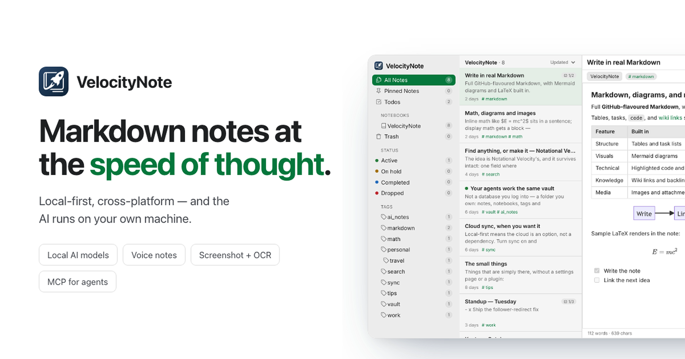

  

<h1 align="center">VelocityNote</h1>

<strong>Markdown notes at the speed of thought.</strong>

  A fast, native, local-first notebook born in the age of agentic AI.

  <a href="https://velocitynote.app">Website</a> ·
  <a href="https://velocitynote.app/download">Download</a> ·
  <a href="https://velocitynote.app/changelog">Release notes</a> ·
  <a href="https://velocitynote.app/contact">Contact</a>

## Your notes, your machine

VelocityNote keeps your notes on your computer, works without a network connection, and lets you export standard Markdown at any time. It gives you a focused native workspace without tying your knowledge to a proprietary editing model or a single platform.

Cloud sync is optional. You can keep a notebook local-only, or enable sync when you want the same notes across devices.

## Everything a modern notebook needs

| Area | Built into VelocityNote |
| --- | --- |
| **Native performance** | A lightweight desktop app designed to open quickly, keep memory pressure low, and search complete notebooks locally. |
| **Rich Markdown** | Tables, task lists, footnotes, LaTeX, Mermaid diagrams, code highlighting, wiki links, images, and attachments. |
| **Fast retrieval** | SQLite FTS5 full-text search for both people and connected AI agents. |
| **Local AI** | Language models, voice transcription, screenshot OCR, and image description run on your machine. |
| **Agent workflows** | Built-in MCP and agent skills let supported tools search, read, and write the same notebook with you. |
| **Open migration** | Import from Word, PDF, Notion, Evernote, Obsidian, and Markdown folders; export to standard Markdown. |
| **Optional sync** | Work fully offline or add cloud sync across devices when you choose. |

## Local AI, built into the workflow

VelocityNote treats AI as part of the notebook rather than a separate chat window. Local models can help clean up formatting, summarize, outline, transcribe voice notes, and extract information from screenshots while the underlying work remains in your notebook.

### Supported local models

| Capability | Model | Runtime / format | Designed for |
| --- | --- | --- | --- |
| Text generation | **Qwen3-4B** | llama.cpp · GGUF Q4_K_M | Formatting, summarizing, outlining, and other notebook assistance; recommended for machines with 16 GB RAM. |
| Text generation | **Qwen3-1.7B** | llama.cpp · GGUF Q8_0 | A lighter local assistant for machines with 8 GB RAM. |
| English transcription | **Parakeet TDT 0.6B V3** | ONNX · INT8 | Recommended English speech-to-text model with a balance of accuracy and speed. |
| English transcription HQ | **Parakeet TDT 0.6B V3** | ONNX · FP32 | Highest-accuracy English option for difficult or far-field audio; larger and slower. |
| Multilingual transcription | **SenseVoice** | ONNX · INT8 | Auto-detected Chinese, English, Japanese, Korean, and Cantonese speech. |
| Screenshot OCR | **PP-OCRv5 mobile** | ONNX · FP32 | Recognizing searchable text in screenshots, slides, receipts, and whiteboards. |
| Image understanding | **Florence-2-base-ft** | ONNX · INT8 | Image captions, detailed descriptions, and optional image-based OCR. |
| Voice activity detection | **Silero VAD v6.2.1** | ONNX | Detecting speech boundaries automatically during voice capture. |

Models are optional downloads and run through VelocityNote's built-in llama.cpp and ONNX runtimes. Model artifacts are pinned and SHA-256 verified before installation.

## A shared workspace for you and your agents

VelocityNote includes an MCP server and agent skills so supported coding and AI tools can work with the same structured notebook you use. Agents can search across notes, retrieve focused context, and update the notebook without loading an entire folder of plain text into every conversation.

The result is a practical second brain for agentic work: your plans, research, tasks, decisions, and development progress stay in one searchable place.

## Bring your existing notes

Move into one Markdown-centered workspace from:

- Evernote and Notion
- Obsidian and Markdown folders
- Microsoft Word and PDF documents
- Screenshots, images, attachments, and voice recordings

Your content remains portable: export standard Markdown whenever you want it.

## Platform availability

| Platform | Status |
| --- | --- |
| macOS | Available |
| Windows | Available |
| iOS | In development |
| Android | In development |
| Linux | [In development — follow the issue and add a 👍](https://github.com/VelocityNote/velocitynote/issues/5) |

Download the current macOS or Windows installer from [velocitynote.app/download](https://velocitynote.app/download).

## Issues, feedback, and support

- Use [GitHub Issues](https://github.com/VelocityNote/velocitynote/issues) for reproducible bugs, feature requests, and public product feedback.
- Email [contact@velocitynote.app](mailto:contact@velocitynote.app) for account, billing, or other private inquiries.

Please do not post note contents, credentials, payment information, or private account details in a public issue.

